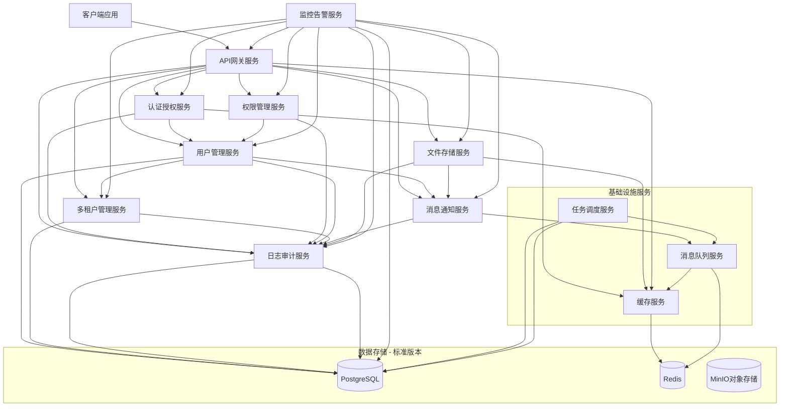
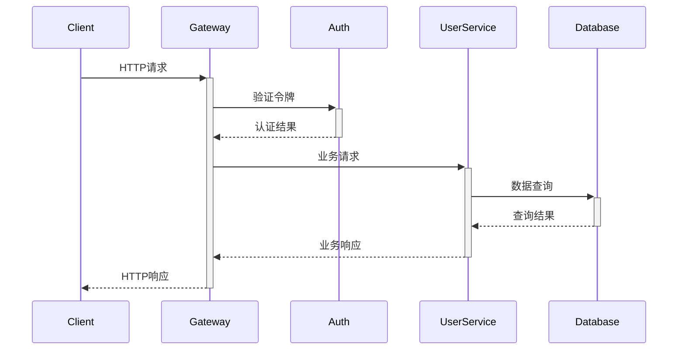
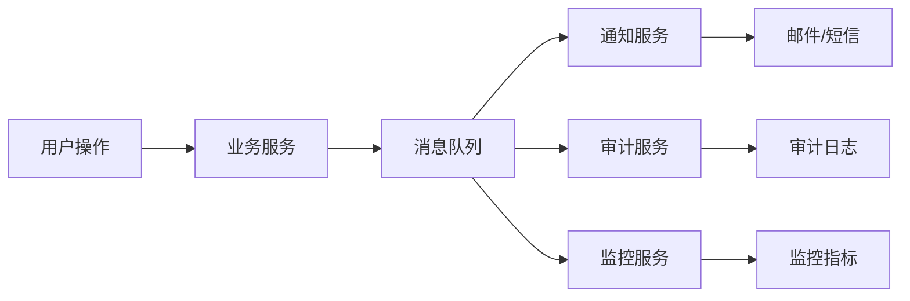

# 企业级微服务平台架构 - 标准版本

## 项目概述

这是一个企业级微服务平台标准版本，面向**100租户+10万用户**的生产系统，为云服务提供商和SaaS公司提供可复用的基础设施服务。平台采用模块化设计，包含12个核心微服务，解决了重复开发基础功能的痛点，可以显著提升项目交付效率。

### 🎯 标准版本定位
- **用户规模**: 支持100个企业租户，总计10万用户
- **性能要求**: 高并发、低延迟、99.9%可用性
- **技术选型**: 选择最适合的技术，避免过度设计
- **部署方式**: Docker Compose部署，无需Kubernetes
- **功能完整**: 生产可用的完整功能，非MVP简化版

## 业务背景

### 核心痛点
- **重复造轮子**: 每个客户项目都要重新开发用户系统、认证、权限管理
- **功能耦合严重**: 单体应用难以独立更新和扩展
- **交付效率低**: 基础功能开发周期长，客户定制需求响应慢
- **维护成本高**: Bug修复影响全局，代码冲突频繁

### 解决方案
通过构建可复用的微服务平台，实现：
- ⚡ **快速启动**: 几小时内完成基础功能搭建
- 🔌 **即插即用**: 新项目直接集成，无需重新开发  
- 🎛️ **灵活配置**: 支持租户级别的功能定制
- 📈 **弹性扩展**: 根据负载独立扩展各个服务
- 💰 **商业价值**: 内部效率工具可发展为外部销售产品

## 项目结构

```
platform/
├── README.md                           # 项目总体说明文档
├── api-gateway-service/                # API网关服务
│   └── development-guide.md            # API网关开发文档
├── auth-service/                       # 认证授权服务
│   └── development-guide.md            # 认证授权开发文档
├── rbac-service/                       # 权限管理服务
│   └── development-guide.md            # 权限管理开发文档
├── user-management-service/            # 用户管理服务
│   └── development-guide.md            # 用户管理开发文档
├── tenant-management-service/          # 多租户管理服务
│   └── development-guide.md            # 多租户管理开发文档
├── notification-service/               # 消息通知服务
│   └── development-guide.md            # 消息通知开发文档
├── file-storage-service/               # 文件存储服务
│   └── development-guide.md            # 文件存储开发文档
├── monitoring-service/                 # 监控告警服务
│   └── development-guide.md            # 监控告警开发文档
├── audit-service/                      # 日志审计服务
│   └── development-guide.md            # 日志审计开发文档
├── scheduler-service/                  # 任务调度服务
│   └── development-guide.md            # 任务调度开发文档
├── message-queue-service/              # 消息队列服务
│   └── development-guide.md            # 消息队列开发文档
└── cache-service/                      # 缓存服务
    └── development-guide.md            # 缓存服务开发文档
```

## 服务架构图



## 核心服务介绍

### 1. API网关服务 (api-gateway-service)
**端口**: 3000  
**职责**: 统一入口、路由转发、认证授权、限流熔断、负载均衡

**核心功能**:
- 🌐 **统一入口**: 所有外部请求的单一入口点
- 🔀 **智能路由**: 基于路径、方法、头部的动态路由
- 🛡️ **认证授权**: JWT、OAuth2、API Key多种认证方式
- ⏱️ **限流控制**: 租户级、用户级、IP级限流
- ⚡ **负载均衡**: 轮询、加权轮询、最少连接等算法
- 🔄 **熔断保护**: 自动故障检测和服务降级
- 📋 **版本管理**: API版本控制和向后兼容
- 💾 **响应缓存**: 智能缓存策略提升性能

### 2. 认证授权服务 (auth-service)
**端口**: 3001  
**职责**: 身份认证、权限授权、会话管理、SSO集成

**核心功能**:
- 🔐 **多重认证**: 用户名密码、短信验证码、邮箱验证
- 🌍 **OAuth集成**: GitHub、Google、微信等第三方登录
- 🎫 **JWT管理**: 非对称加密、令牌刷新、黑名单机制
- 👥 **权限体系**: RBAC角色权限、细粒度权限控制
- 🔄 **SSO支持**: 单点登录和统一登出
- 🛡️ **安全策略**: 密码策略、登录限制、异常检测
- 📱 **MFA支持**: 多因子认证增强安全性

### 3. 权限管理服务 (rbac-service)
**端口**: 3002  
**职责**: 角色权限、访问控制、权限验证、RBAC管理

**核心功能**:
- 🔐 **角色管理**: 角色定义、角色分配、层级关系
- 🎯 **权限控制**: 细粒度权限、资源权限、操作权限
- 👥 **用户授权**: 用户角色绑定、权限继承、临时授权
- 🔍 **权限验证**: 实时权限检查、权限缓存、批量验证
- 📋 **权限审计**: 权限变更记录、访问日志、合规检查
- 🔄 **动态权限**: 基于条件的权限、时间权限、地域权限
- 🛡️ **安全策略**: 最小权限原则、权限分离、职责分离

### 4. 用户管理服务 (user-management-service)
**端口**: 3003  
**职责**: 用户生命周期、个人资料、偏好设置、组织架构

**核心功能**:
- 👤 **用户档案**: 完整的用户信息管理
- 🏢 **组织架构**: 部门、团队、层级关系管理
- ⚙️ **偏好设置**: 个性化配置和主题设置
- 📊 **用户分析**: 活跃度、行为分析、标签系统
- 🔄 **数据同步**: 与外部系统的用户数据同步
- 📋 **批量操作**: 用户导入导出、批量更新
- 🔍 **高级搜索**: 多维度用户搜索和筛选

### 5. 多租户管理服务 (tenant-management-service)
**端口**: 3004  
**职责**: 租户隔离、资源配额、计费管理、白标定制

**核心功能**:
- 🏠 **租户隔离**: 数据、配置、资源完全隔离
- 💼 **订阅管理**: 套餐计划、升级降级、计费周期
- 📊 **资源配额**: CPU、内存、存储、API调用限制
- 🎨 **白标定制**: 品牌logo、主题色彩、域名绑定
- 💰 **计费集成**: Stripe、支付宝等支付网关集成
- 📈 **使用统计**: 资源使用情况和成本分析
- ⚠️ **配额告警**: 资源使用预警和自动扩容

### 6. 消息通知服务 (notification-service)
**端口**: 3005  
**职责**: 多渠道通知、模板管理、消息队列、用户偏好

**核心功能**:
- 📧 **邮件通知**: SMTP、SendGrid、阿里云邮推
- 📱 **短信通知**: 阿里云短信、腾讯云短信、Twilio
- 🔔 **推送通知**: Firebase、极光推送、个推
- 🌐 **WebSocket**: 实时消息推送
- 📝 **模板引擎**: 可视化模板编辑器
- ⏰ **定时发送**: 延迟发送、定时任务
- 🎯 **智能路由**: 基于用户偏好的渠道选择
- 📊 **发送统计**: 送达率、打开率、点击率分析

### 7. 文件存储服务 (file-storage-service)
**端口**: 3006  
**职责**: 文件上传、存储管理、CDN加速、媒体处理

**核心功能**:
- ☁️ **多云存储**: AWS S3、阿里云OSS、腾讯云COS
- 📤 **断点续传**: 大文件分片上传、断点续传
- 🖼️ **图片处理**: 缩略图生成、格式转换、水印添加
- 🎬 **视频处理**: 转码、截图、压缩
- 🔒 **访问控制**: 文件权限、分享链接、防盗链
- 🦠 **安全扫描**: 病毒检测、文件类型验证
- 🚀 **CDN加速**: 全球内容分发网络
- 📊 **存储分析**: 使用统计、成本优化

### 8. 监控告警服务 (monitoring-service)
**端口**: 3007  
**职责**: 系统监控、性能分析、告警管理、SLA监控

**核心功能**:
- 📊 **指标收集**: CPU、内存、网络、业务指标
- 🏥 **健康检查**: 服务可用性、依赖检查
- ⚠️ **智能告警**: 阈值告警、异常检测、告警收敛
- 📈 **SLA监控**: 可用性、响应时间、错误率
- 🎨 **可视化仪表板**: Grafana集成、自定义面板
- 🔄 **自动修复**: 服务重启、扩容缩容
- 📱 **多渠道告警**: 邮件、短信、钉钉、Slack

### 9. 日志审计服务 (audit-service)
**端口**: 3008  
**职责**: 操作日志、合规审计、安全分析、数据治理

**核心功能**:
- 📝 **操作审计**: 用户行为、系统操作完整记录
- 🏛️ **合规管理**: GDPR、HIPAA、SOX等法规遵循
- 🔍 **日志搜索**: 强大的日志查询和分析功能
- 🚨 **安全事件**: 异常行为检测、威胁识别
- 📊 **可视化分析**: 操作趋势、用户行为分析
- 🔄 **数据生命周期**: 自动归档、删除策略
- 📤 **数据导出**: 审计报告、证据导出

### 10. 任务调度服务 (scheduler-service)
**端口**: 3009  
**职责**: 定时任务、周期调度、任务流编排、资源管理

**核心功能**:
- ⏰ **定时调度**: Cron表达式、延时任务、重复任务
- 🔄 **任务编排**: 工作流定义、依赖管理、并行执行
- 📊 **执行监控**: 任务状态跟踪、执行历史、性能分析
- 🔧 **任务管理**: 任务创建、暂停、恢复、取消
- 🎯 **负载均衡**: 多节点调度、资源分配、故障转移
- 📋 **任务队列**: 优先级队列、延迟队列、死信队列
- 🔒 **权限控制**: 任务权限、执行权限、资源访问控制

### 11. 消息队列服务 (message-queue-service)
**端口**: 3010  
**职责**: 异步消息、解耦通信、事件驱动、可靠传输

**核心功能**:
- 📨 **消息发布**: 点对点、发布订阅、广播模式
- 🔄 **消息路由**: 主题路由、内容路由、头部路由
- 📋 **队列管理**: 队列创建、配置、监控、清理
- 🔒 **可靠传输**: 消息确认、重试机制、死信处理
- 📊 **性能监控**: 吞吐量统计、延迟分析、积压监控
- 🎯 **负载均衡**: 消费者负载均衡、分区分配
- 🔧 **集群管理**: 多节点部署、数据复制、故障恢复

### 12. 缓存服务 (cache-service)
**端口**: 3011  
**职责**: 分布式缓存、会话存储、性能优化、数据加速

**核心功能**:
- 💾 **缓存策略**: LRU、LFU、TTL过期、主动刷新
- 🔄 **数据同步**: 缓存一致性、更新通知、版本控制
- 📊 **性能监控**: 命中率统计、响应时间、内存使用
- 🔧 **集群管理**: 主从复制、分片存储、故障切换
- 🎯 **智能预热**: 预加载热点数据、预测性缓存
- 🔒 **安全控制**: 访问权限、数据加密、安全隔离
- 📋 **操作管理**: 批量操作、模式匹配、数据导入导出

## 管理和监控架构

### 统一管理方案
采用**单一管理前端**架构，每个微服务只保留业务端口，所有管理功能通过统一的Admin Dashboard提供。

### 端口分配策略
- **3000-3011**: 核心业务微服务
- **8000-8999**: 管理服务
- **9000-9999**: 监控和分析服务
- **5000-5999**: 可视化服务

### Admin Dashboard (端口8080)
统一管理前端包含以下功能：
- 🎛️ **服务管理**: 启动/停止/重启各个微服务
- 📊 **健康检查**: 实时查看所有服务状态
- ⚙️ **配置管理**: 统一修改各服务配置
- 📈 **监控面板**: 嵌入Grafana仪表板
- 👥 **用户管理**: 管理员账户和权限控制
- 🔧 **系统设置**: 全局配置和系统参数

### 监控服务端口
- **9090**: Prometheus (指标收集)
- **9091**: Grafana (监控面板)
- **9200**: Elasticsearch (日志搜索)
- **5601**: Kibana (日志分析界面)
- **8500**: Consul (服务发现)

## 技术栈选择

### 后端技术栈
- **框架**: NestJS 10.x + TypeScript 5.x
  - 企业级Node.js框架，装饰器语法简洁
  - 内置依赖注入、模块化架构
  - 强类型支持，降低运行时错误

- **数据库**: 
  - PostgreSQL 15+ (主数据存储)
  - Redis 7+ (缓存、会话、消息队列)
  - Elasticsearch 8.x (日志搜索)
  - InfluxDB 2.x (时序数据)

- **ORM**: Prisma ORM
  - 类型安全的数据库访问
  - 自动生成客户端代码
  - 数据库迁移管理

### 容器化与编排
- **容器**: Docker + Docker Compose
- **编排**: Kubernetes
- **服务网格**: Istio (可选)
- **CI/CD**: GitHub Actions / GitLab CI

### 监控与可观测性
- **指标**: Prometheus + Grafana
- **日志**: ELK Stack (Elasticsearch + Logstash + Kibana)
- **链路追踪**: Jaeger / Zipkin
- **告警**: Alertmanager

### 安全与合规
- **认证**: JWT (RS256) + OAuth 2.0
- **加密**: bcrypt + AES-256
- **API安全**: 限流、防重放、输入验证
- **合规**: GDPR、HIPAA数据保护

## 部署架构

### 开发环境
```bash
# 单机部署
docker-compose up -d

# 包含所有服务和依赖
# 适合本地开发和测试
```

### 生产环境
```bash
# Docker Compose简化部署
docker-compose -f docker-compose.prod.yml up -d

# 高可用、水平扩展
# 支持健康检查、自动重启
```

### 标准版本特性
- ☸️ **Docker Compose**: 简单的容器编排
- 🔄 **水平扩展**: 多实例部署 + Nginx负载均衡
- 💾 **数据持久化**: Docker Volume存储管理
- 🔒 **配置管理**: 环境变量 + .env文件
- 🌐 **服务发现**: Docker Compose内置网络
- 📊 **资源监控**: Prometheus + Grafana + PostgreSQL

## 数据流架构

### 同步通信


### 异步通信


## 开发指南

### 环境要求
- Node.js 18+
- Docker & Docker Compose
- PostgreSQL 15+
- Redis 7+

### 快速启动
```bash
# 1. 克隆项目
git clone <project-url>
cd platform

# 2. 启动基础设施
docker-compose up -d postgres redis elasticsearch influxdb

# 3. 启动各个服务
cd api-gateway-service && npm install && npm run start:dev &
cd auth-service && npm install && npm run start:dev &
cd user-management-service && npm install && npm run start:dev &
# ... 其他服务

# 4. 访问服务
open http://localhost:3000  # API网关
open http://localhost:3001  # 认证服务
```

### 开发工作流
1. **功能开发**: 在对应服务目录下开发新功能
2. **接口设计**: 遵循RESTful API设计规范
3. **测试编写**: 单元测试 + 集成测试 + E2E测试
4. **代码审查**: PR Review流程
5. **部署发布**: CI/CD自动化部署

### 代码规范
- **TypeScript**: 强类型，ESLint + Prettier
- **Git提交**: Conventional Commits规范
- **API文档**: OpenAPI/Swagger自动生成
- **测试覆盖率**: 目标80%+

## 性能指标

### 服务性能目标
| 指标 | 目标值 | 说明 |
|-----|--------|------|
| 响应时间 | P95 < 100ms | 95%请求响应时间 |
| 可用性 | 99% | 年度可用性目标 |
| 吞吐量 | 1000 QPS | 整体系统处理能力 |
| 错误率 | < 1% | 系统错误率 |

### 扩展性目标
- **用户规模**: 支持100万+活跃用户
- **租户数量**: 支持10000+租户
- **并发请求**: 支持10万+并发
- **数据存储**: 支持PB级数据

## 商业价值

### 内部效率提升
- 📊 **开发效率**: 项目交付周期缩短60%
- 💰 **成本节约**: 基础功能零开发时间
- 👥 **团队协作**: 并行开发多个项目
- 🚀 **快速迭代**: 专注业务逻辑开发

### 外部商业化
- 🏢 **SaaS服务**: 认证即服务、通知即服务
- 🏷️ **白标方案**: 品牌定制化解决方案  
- 🛍️ **应用商店**: 插件生态系统建设
- 🎓 **技术服务**: 集成咨询和培训服务

### 变现模式
- 💰 **按量计费**: API调用次数、存储空间
- 📦 **订阅模式**: 功能模块、租户数量
- 🏷️ **授权费用**: 私有化部署授权
- 🛠️ **专业服务**: 定制开发、技术支持

## 安全架构

### 多层安全防护
1. **网络层**: WAF、DDoS防护、IP白名单
2. **应用层**: 认证授权、输入验证、SQL注入防护
3. **数据层**: 加密存储、备份恢复、访问审计
4. **运维层**: 安全扫描、漏洞管理、应急响应

### 合规认证
- 🏛️ **GDPR**: 欧盟数据保护法规
- 🏥 **HIPAA**: 美国医疗信息安全
- 📊 **SOX**: 萨班斯法案财务合规
- 💳 **PCI DSS**: 支付卡行业安全标准

## 运维管理

### 监控体系
- 📊 **基础监控**: CPU、内存、磁盘、网络
- 🔍 **应用监控**: 响应时间、错误率、吞吐量
- 💼 **业务监控**: 用户活跃度、转化率、收入
- 🔒 **安全监控**: 异常登录、权限变更、攻击检测

### 运维自动化
- 🤖 **自动部署**: CI/CD流水线
- 📈 **自动扩容**: 基于负载的弹性伸缩
- 🔧 **自动修复**: 服务异常自动重启
- 📋 **自动巡检**: 健康检查和问题发现

## 贡献指南

### 参与方式
1. **Issue反馈**: 发现问题或建议功能
2. **代码贡献**: 提交Pull Request
3. **文档改进**: 完善技术文档
4. **测试验证**: 参与功能测试

### 联系方式
- 📧 **邮箱**: dev@yourcompany.com
- 💬 **Slack**: #platform-dev
- 📋 **文档**: https://docs.yourcompany.com
- 🐛 **问题**: https://github.com/yourcompany/platform/issues

---

**这个企业级微服务平台将彻底解决重复开发基础功能的痛点，同时创造新的商业价值。从内部效率工具演进为可销售的企业级产品，实现技术价值与商业价值的双重提升！**