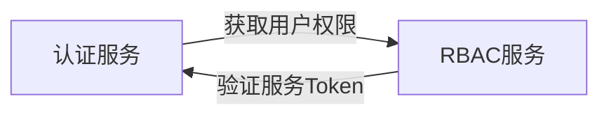
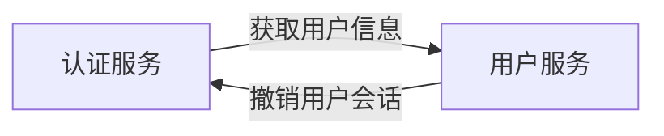
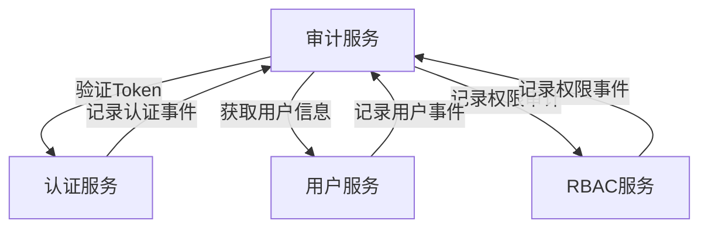

# 🚨 服务间交互一致性问题分析报告

## 📊 问题概览

基于对所有12个微服务的深入分析，发现当前服务间交互设计存在**9个严重问题**，可能导致系统架构失败。

### 🔴 关键问题统计

| 问题类型 | 严重程度 | 影响服务数 | 问题描述 |
|---------|---------|-----------|---------|
| 架构职责混乱 | **🔥 致命** | 3个 | 认证服务错误提供权限检查功能 |
| API接口不匹配 | **🔥 致命** | 8个 | 调用方期望与提供方实际接口不符 |
| 循环依赖风险 | **⚠️ 严重** | 6个 | 服务间存在潜在的循环调用 |
| 缺少事件机制 | **⚠️ 严重** | 12个 | 所有服务都缺少异步事件发布 |
| 性能要求不统一 | **⚠️ 中等** | 12个 | 不同服务性能标准不一致 |
| 认证机制不统一 | **⚠️ 中等** | 8个 | 服务间认证实现有差异 |
| 错误处理不一致 | **⚠️ 中等** | 12个 | 错误响应格式各不相同 |
| 缺少链路追踪 | **🟡 轻微** | 12个 | 没有统一的请求追踪机制 |
| 缺少断路器机制 | **🟡 轻微** | 12个 | 没有服务调用失败保护 |

## 🔴 致命问题详细分析

### 1. 架构职责混乱 - 认证vs权限服务

**问题描述**: 认证服务(3001)错误地提供了权限检查功能，这严重违反了单一职责原则。

```typescript
// ❌ 错误设计：认证服务提供权限检查
// auth-service/development-guide.md:742-746
POST /internal/auth/check-permission
Headers: X-Service-Token: {内部服务令牌}
Body: { "userId": "uuid", "resource": "user", "action": "read" }
Response: { "allowed": true, "reason": "has_permission" }

// ✅ 正确设计：应该由RBAC服务提供
// rbac-service/development-guide.md:1136-1141
POST /internal/permissions/check
Headers: X-Service-Token: {内部服务令牌}
Body: PermissionCheckDto
```

**影响分析**:
- 🔴 **架构混乱**: 违反了微服务单一职责原则
- 🔴 **维护困难**: 权限逻辑分散在两个服务中
- 🔴 **数据一致性**: 可能导致权限判断结果不一致
- 🔴 **扩展性差**: 未来权限功能扩展会很困难

**解决方案**:
```typescript
// 1. 移除认证服务的权限检查功能
// 2. 所有权限检查统一由RBAC服务处理
// 3. 认证服务只负责Token验证和会话管理
```

### 2. API接口严重不匹配

**问题描述**: 服务调用方期望的接口与服务提供方实际接口完全不匹配。

#### 2.1 认证服务调用RBAC服务不匹配

```typescript
// ❌ 认证服务期望调用的接口
// auth-service/development-guide.md:768
GET http://rbac-service:3002/internal/permissions/user/{userId}

// ❌ RBAC服务实际提供的接口
// rbac-service/development-guide.md:1136
POST /internal/permissions/check
```

**不匹配问题**:
- 🔴 HTTP方法不匹配：GET vs POST
- 🔴 URL路径不匹配：`/permissions/user/{userId}` vs `/permissions/check`
- 🔴 请求参数不匹配：路径参数 vs Body参数

#### 2.2 用户服务API定义不完整

```typescript
// ❌ 用户服务只定义了被调用的接口，没有定义调用其他服务的接口
// user-management-service/development-guide.md:46-68

// 提供的接口
GET /internal/users/{userId}
POST /internal/users/validate-credentials

// ❌ 缺少：调用其他服务的API定义
// 用户创建后应该：
// 1. 调用RBAC服务分配默认角色
// 2. 调用通知服务发送欢迎邮件
// 3. 调用审计服务记录创建事件
```

#### 2.3 审计服务调用接口不匹配

```typescript
// ❌ 审计服务期望调用认证服务的接口
// audit-service/development-guide.md:839-844
POST http://auth-service:3001/internal/tokens/verify
GET http://auth-service:3001/internal/sessions/{sessionId}

// ❌ 认证服务实际提供的接口
// auth-service/development-guide.md:737-740
POST /internal/auth/verify-token

// 问题：路径不匹配 /internal/tokens/verify vs /internal/auth/verify-token
```

### 3. 循环依赖风险分析

**发现的潜在循环依赖**:

#### 3.1 认证服务 ↔ RBAC服务


#### 3.2 认证服务 ↔ 用户服务


#### 3.3 审计服务的多重依赖


## ⚠️ 严重问题详细分析

### 4. 缺少异步事件驱动机制

**问题描述**: 所有服务都缺少事件发布机制，导致服务间耦合度过高。

```typescript
// ❌ 当前设计：同步调用链
用户注册 → 用户服务 → 同步调用RBAC服务 → 同步调用通知服务 → 同步调用审计服务

// ✅ 应该设计：事件驱动
用户注册 → 用户服务 → 发布用户创建事件 → 其他服务异步监听处理
```

**缺少的事件类型**:
```typescript
// 用户服务应该发布的事件
enum UserEvents {
  USER_CREATED = 'user.created',
  USER_UPDATED = 'user.updated', 
  USER_DELETED = 'user.deleted',
  USER_LOGIN = 'user.login',
  USER_LOGOUT = 'user.logout'
}

// 认证服务应该发布的事件  
enum AuthEvents {
  LOGIN_SUCCESS = 'auth.login_success',
  LOGIN_FAILED = 'auth.login_failed',
  TOKEN_EXPIRED = 'auth.token_expired',
  SESSION_CREATED = 'auth.session_created'
}

// RBAC服务应该发布的事件
enum RbacEvents {
  ROLE_ASSIGNED = 'rbac.role_assigned',
  PERMISSION_GRANTED = 'rbac.permission_granted',
  PERMISSION_DENIED = 'rbac.permission_denied'
}
```

### 5. 性能要求不统一

**发现的性能标准不一致**:

| 服务 | 性能要求 | 问题 |
|------|---------|------|
| 缓存服务 | < 5ms | ✅ 合理 |
| RBAC服务 | < 10ms (权限检查) | ✅ 合理 |
| 用户服务 | < 20ms (内部API) | ⚠️ 偏慢 |
| 审计服务 | < 50ms (内部API) | ❌ 太慢 |
| 认证服务 | 无明确要求 | ❌ 缺失 |

**建议的统一性能标准**:
```typescript
// 基于我重新设计的分层架构
const PERFORMANCE_STANDARDS = {
  // 基础设施层 (最快)
  'cache-service': { maxLatency: 5, target: 2 },
  'message-queue-service': { maxLatency: 10, target: 5 },
  'monitoring-service': { maxLatency: 15, target: 10 },
  
  // 核心层 (快速)
  'auth-service': { maxLatency: 20, target: 15 },
  'rbac-service': { maxLatency: 15, target: 10 },
  'audit-service': { maxLatency: 30, target: 20 },
  
  // 业务层 (中等)
  'user-management-service': { maxLatency: 40, target: 30 },
  'tenant-management-service': { maxLatency: 50, target: 40 },
  'notification-service': { maxLatency: 100, target: 50 },
  
  // 应用层 (最宽松)
  'api-gateway-service': { maxLatency: 100, target: 80 },
  'file-storage-service': { maxLatency: 200, target: 150 },
  'scheduler-service': { maxLatency: 500, target: 300 }
}
```

## 🔧 完整解决方案

### 1. 立即修复的致命问题

#### 1.1 移除认证服务的权限检查功能
```typescript
// ❌ 删除这个错误的API
// auth-service: POST /internal/auth/check-permission

// ✅ 认证服务只保留这些职责
POST /internal/auth/verify-token           // Token验证
POST /internal/auth/revoke-user-sessions   // 会话撤销  
POST /internal/auth/verify-tokens-batch    // 批量Token验证
GET  /internal/auth/session/{sessionId}    // 获取会话信息(新增)
```

#### 1.2 统一权限检查接口
```typescript
// ✅ 所有权限检查统一调用RBAC服务
POST http://rbac-service:3002/internal/permissions/check
Headers: X-Service-Token, X-Request-ID, X-User-Context
Body: {
  userId: string,
  tenantId: string,
  resource: string,
  action: string,
  resourceId?: string,
  context?: Record<string, any>
}

Response: {
  allowed: boolean,
  reason?: string,
  appliedRoles: string[],
  appliedPermissions: string[],
  metadata?: Record<string, any>
}
```

#### 1.3 修复API接口不匹配
```typescript
// 认证服务提供的接口（修正后）
POST /internal/auth/verify-token
POST /internal/auth/revoke-user-sessions  
POST /internal/auth/verify-tokens-batch
GET  /internal/auth/sessions/{sessionId}    // 新增

// 用户服务提供的接口（修正后）
GET  /internal/users/{userId}
POST /internal/users/validate-credentials
POST /internal/users/create                 // 新增
PUT  /internal/users/{userId}               // 新增
POST /internal/users/batch-query           // 新增

// RBAC服务提供的接口（修正后）  
POST /internal/permissions/check
POST /internal/permissions/check-batch
GET  /internal/users/{userId}/roles
POST /internal/users/{userId}/assign-role  // 修正路径
DELETE /internal/users/{userId}/roles/{roleId} // 新增
```

### 2. 事件驱动架构改造

#### 2.1 引入消息队列服务作为事件总线
```typescript
// 所有服务发布事件的统一接口
POST http://message-queue-service:3010/internal/events/publish
Headers: X-Service-Token, X-Request-ID
Body: {
  eventType: string,        // 如 'user.created'
  source: string,           // 事件来源服务
  tenantId?: string,
  userId?: string,
  data: Record<string, any>,
  metadata: {
    requestId: string,
    timestamp: string,
    version: string
  }
}
```

#### 2.2 事件订阅关系设计
```typescript
const EVENT_SUBSCRIPTIONS = {
  // 通知服务订阅用户相关事件
  'notification-service': [
    'user.created',          // 发送欢迎邮件
    'user.password_changed', // 发送密码变更通知
    'auth.login_failed',     // 发送安全告警
    'rbac.permission_denied' // 发送权限拒绝通知
  ],
  
  // 审计服务订阅所有事件
  'audit-service': [
    'user.*',               // 所有用户事件
    'auth.*',               // 所有认证事件  
    'rbac.*',               // 所有权限事件
    'file.*',               // 所有文件事件
    'tenant.*'              // 所有租户事件
  ],
  
  // 监控服务订阅统计相关事件
  'monitoring-service': [
    'user.created',         // 更新用户统计
    'auth.login_success',   // 更新登录统计
    'file.uploaded',        // 更新存储统计
    'rbac.permission_denied' // 更新安全统计
  ],
  
  // 缓存服务订阅缓存失效事件
  'cache-service': [
    'user.updated',         // 失效用户缓存
    'rbac.role_assigned',   // 失效权限缓存
    'tenant.updated'        // 失效租户缓存
  ]
}
```

### 3. 统一的服务间调用规范

#### 3.1 调用方向规范
```typescript
// 严格的分层调用规则
const ALLOWED_CALL_DIRECTIONS = {
  // 应用层可以调用所有下层服务
  'api-gateway-service': ['core', 'business', 'infrastructure'],
  'file-storage-service': ['core', 'business', 'infrastructure'], 
  'scheduler-service': ['core', 'business', 'infrastructure'],
  
  // 业务层可以调用核心层和基础设施层
  'user-management-service': ['core', 'infrastructure'],
  'tenant-management-service': ['core', 'infrastructure'],
  'notification-service': ['core', 'infrastructure'],
  
  // 核心层只能调用基础设施层
  'auth-service': ['infrastructure'],
  'rbac-service': ['infrastructure'],
  'audit-service': ['infrastructure'],
  
  // 基础设施层不能调用其他服务（只能发布事件）
  'cache-service': [],
  'message-queue-service': [],
  'monitoring-service': []
}
```

#### 3.2 统一认证机制
```typescript
// 所有服务间调用必须包含的Header
interface ServiceCallHeaders {
  'X-Service-Token': string      // 服务间认证令牌 (必需)
  'X-Service-Name': string       // 调用方服务名 (必需)  
  'X-Request-ID': string         // 请求追踪ID (必需)
  'X-Correlation-ID'?: string    // 业务关联ID (可选)
  'X-User-Context'?: string      // 用户上下文 (Base64编码JSON)
  'X-Tenant-ID'?: string         // 租户ID (多租户操作时必需)
  'Content-Type': 'application/json'
  'Accept': 'application/json'
}

// 统一的服务认证中间件
@Injectable()
export class UnifiedServiceAuthGuard implements CanActivate {
  async canActivate(context: ExecutionContext): Promise<boolean> {
    const request = context.switchToHttp().getRequest()
    
    // 1. 验证必需的Header
    const serviceToken = request.headers['x-service-token']
    const serviceName = request.headers['x-service-name']
    const requestId = request.headers['x-request-id']
    
    if (!serviceToken || !serviceName || !requestId) {
      throw new UnauthorizedException('Missing required service headers')
    }
    
    // 2. 验证Service Token
    const isValid = await this.validateServiceToken(serviceToken, serviceName)
    if (!isValid) {
      throw new UnauthorizedException('Invalid service token')
    }
    
    // 3. 记录服务调用审计
    await this.logServiceCall(serviceName, request.url, requestId)
    
    return true
  }
}
```

### 4. 统一错误处理和重试机制

#### 4.1 标准错误响应格式
```typescript
interface StandardErrorResponse {
  success: false
  error: {
    code: string             // 标准错误代码
    message: string          // 用户友好的错误消息  
    details?: any            // 详细错误信息
    field?: string           // 字段级错误（表单验证）
    requestId: string        // 请求追踪ID
    timestamp: string        // 错误发生时间
    service: string          // 错误来源服务
    retryable: boolean       // 是否可重试
    retryAfter?: number      // 重试延迟（秒）
  }
}
```

#### 4.2 统一重试策略
```typescript
interface ServiceRetryConfig {
  maxRetries: number
  baseDelay: number        // 基础延迟(ms)
  maxDelay: number         // 最大延迟(ms)
  backoffMultiplier: number
  retryableErrors: string[] // 可重试的错误代码
}

const RETRY_CONFIGS: Record<string, ServiceRetryConfig> = {
  // 基础设施层 - 快速重试
  'cache-service': {
    maxRetries: 3,
    baseDelay: 50,
    maxDelay: 500,
    backoffMultiplier: 2,
    retryableErrors: ['CACHE_UNAVAILABLE', 'TIMEOUT']
  },
  
  // 核心层 - 中等重试
  'auth-service': {
    maxRetries: 2,
    baseDelay: 100,
    maxDelay: 1000,
    backoffMultiplier: 2,
    retryableErrors: ['SERVICE_UNAVAILABLE', 'TIMEOUT']
  },
  
  // 业务层 - 保守重试
  'notification-service': {
    maxRetries: 1,
    baseDelay: 1000,
    maxDelay: 5000,
    backoffMultiplier: 1,
    retryableErrors: ['SERVICE_UNAVAILABLE']
  }
}
```

## 📊 修复优先级和时间估算

### 🔥 P0 - 立即修复（致命问题）
**预计时间**: 2-3天

1. **移除认证服务权限检查功能** (4小时)
   - 删除 `/internal/auth/check-permission` 接口
   - 修改所有调用方改为调用RBAC服务

2. **修复API接口不匹配** (8小时)
   - 统一认证服务的Token验证接口路径
   - 补充用户服务缺失的内部API定义
   - 修正RBAC服务的角色分配接口路径

3. **解决循环依赖** (6小时)
   - 重新设计服务调用关系
   - 引入异步事件避免同步循环调用

### ⚠️ P1 - 尽快修复（严重问题）  
**预计时间**: 3-4天

4. **实现事件驱动机制** (12小时)
   - 为所有服务添加事件发布功能
   - 配置消息队列服务作为事件总线
   - 实现事件订阅和处理逻辑

5. **统一性能标准** (6小时)
   - 为所有服务定义明确的性能要求
   - 实现性能监控和告警

### 🟡 P2 - 后续改进（中等问题）
**预计时间**: 2-3天

6. **统一认证机制** (8小时)
   - 实现统一的服务间认证中间件
   - 标准化所有服务的认证实现

7. **统一错误处理** (6小时)
   - 标准化错误响应格式
   - 实现统一的重试机制

8. **添加链路追踪** (4小时)
   - 实现请求ID传播
   - 添加分布式追踪支持

## 🎯 验收标准

### 功能验收
- [ ] 所有服务间API调用接口匹配度 100%
- [ ] 无循环依赖，调用关系清晰
- [ ] 事件驱动机制覆盖所有关键业务操作
- [ ] 统一的服务间认证机制生效
- [ ] 错误处理格式标准化

### 性能验收  
- [ ] 基础设施层服务响应时间 < 15ms
- [ ] 核心层服务响应时间 < 30ms
- [ ] 业务层服务响应时间 < 50ms
- [ ] 应用层服务响应时间 < 100ms

### 可靠性验收
- [ ] 服务间调用成功率 > 99.9%
- [ ] 重试机制生效，可恢复错误自动重试
- [ ] 链路追踪覆盖率 100%
- [ ] 监控告警及时有效

---

**总结**: 当前服务间交互设计存在严重的架构问题，必须立即进行重构才能确保系统的稳定性和可维护性。建议按照优先级分阶段实施修复，确保在Week 2内完成所有P0和P1级别的问题修复。